# 🚒 Sistema de Gestão Emergencial – ONG Brigada Caxinguelê

> **Status do Projeto:** Concluído / Em documentação  
> **Papel no Projeto:** Analista de Sistemas & Gestor de Projetos de TI  

---

## 📌 Visão Geral do Projeto
O projeto consiste na concepção, mapeamento de requisitos, arquitetura e modelagem de um sistema multiplataforma para a ONG Brigada Caxinguelê (Mairiporã-SP), focado na otimização da comunicação, cadastro e gestão de ocorrências emergenciais.

---

## 🛠️ Competências & Ferramentas Aplicadas
* **Gestão & Processos:** Levantamento de Requisitos, Mapeamento de Processos (BPMN), Metodologias Ágeis (Kanban/Trello).
* **Modelagem de Sistemas:** Diagramas UML (Casos de Uso, Diagrama de Classes), Regras de Negócio.
* **Banco de Dados:** Modelagem Conceitual (DER) e Lógica em SQL.
* **Governança & Segurança:** Requisitos Não-Funcionais, Segurança da Informação e conformidade com LGPD.

---

## 📐 Principais Entregáveis Técnicos

### 1. Mapeamento de Processos (BPMN)
Análise e otimização dos fluxos operacionais da brigada:
* **Cenário Inicial (As-Is):**  
  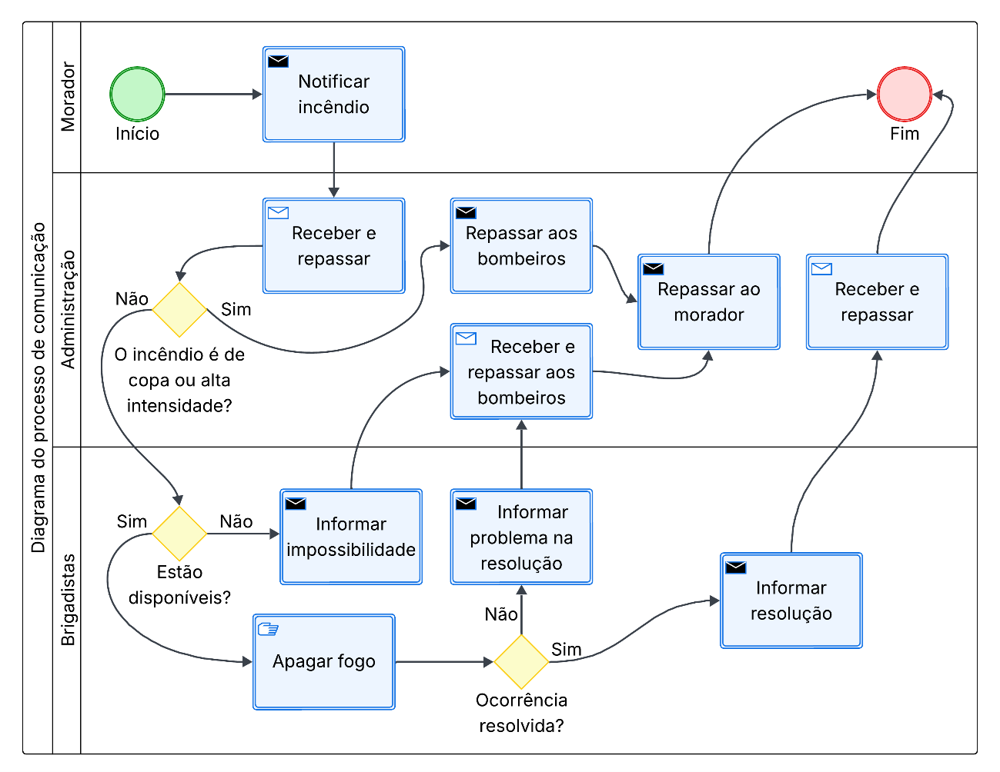
* **Cenário Proposto (To-Be):**  
  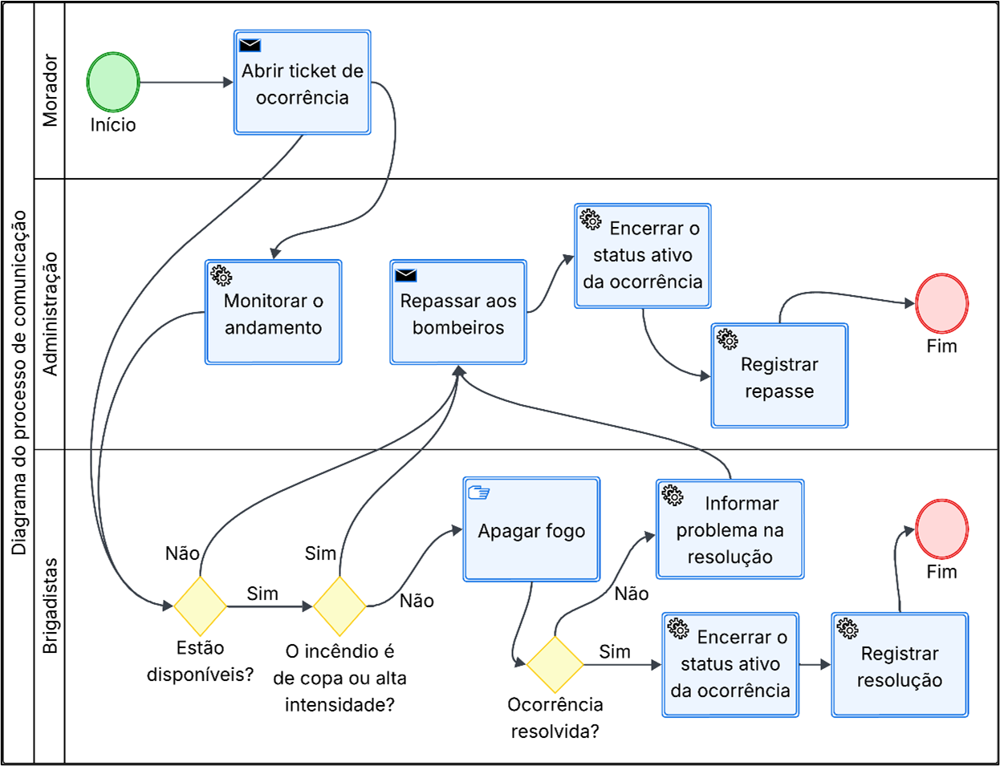

---

### 2. Engenharia de Requisitos
Mapeamento e especificação completa das necessidades do sistema:
* **Requisitos Funcionais:**  
  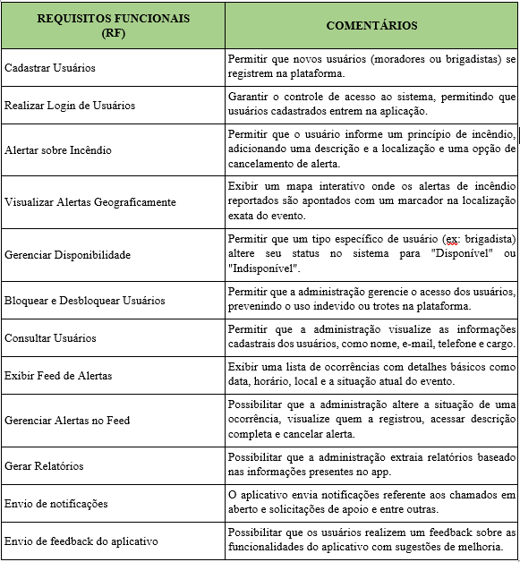
* **Requisitos Não-Funcionais:**  
  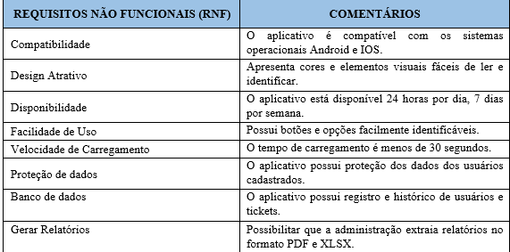
* **Requisitos de Segurança:**  
  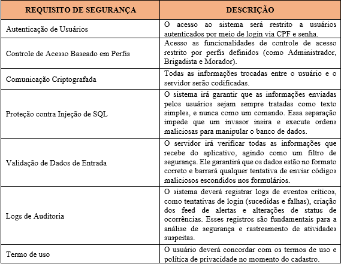

---

### 3. Modelagem de Banco de Dados
Projetada para garantir a integridade e alta disponibilidade das informações:
* **Modelo Conceitual (DER):**  
  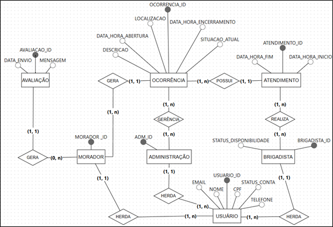
* **Modelo Lógico:**  
  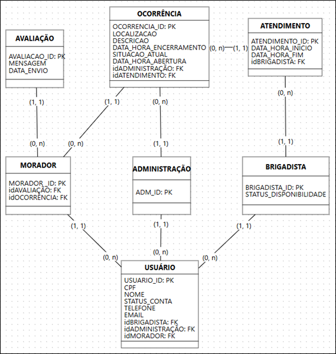

---

### 4. Arquitetura & Diagramação UML
* **Diagrama de Casos de Uso:** Mapeamento das interações dos usuários com o sistema.  
  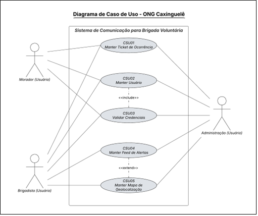
* **Diagrama de Classes:** Estrutura e relacionamento das entidades do sistema.  
  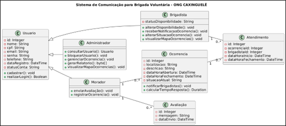

---

### 5. Gestão Ágil & Organização do Backlog (Kanban / Trello)
Acompanhamento de entregas, priorização e organização das histórias de usuário com o framework Kanban:
* **Visão Geral do Quadro Kanban:**  
  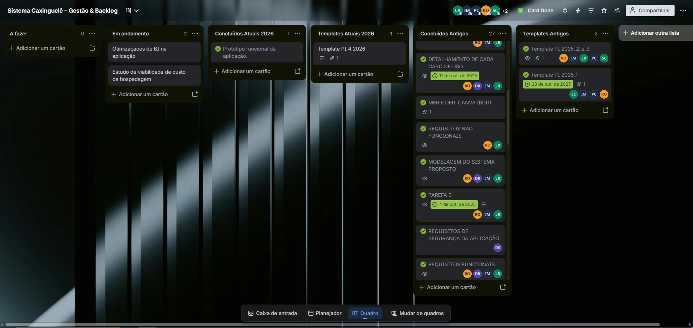
* **Detalhamento de Card & Critérios de Aceite:**  
  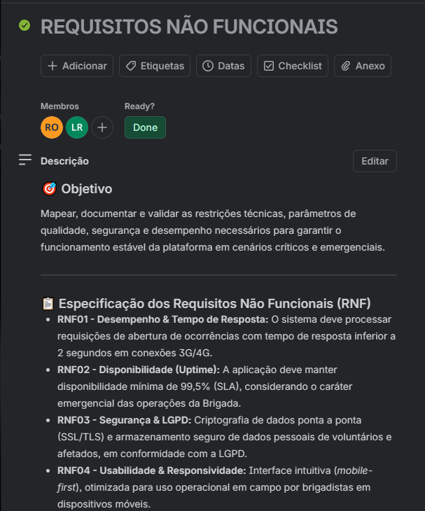

---

## 📄 Documentação Completa
A documentação acadêmica detalhada e completa em formato PDF está disponível para download nos arquivos do repositório.
